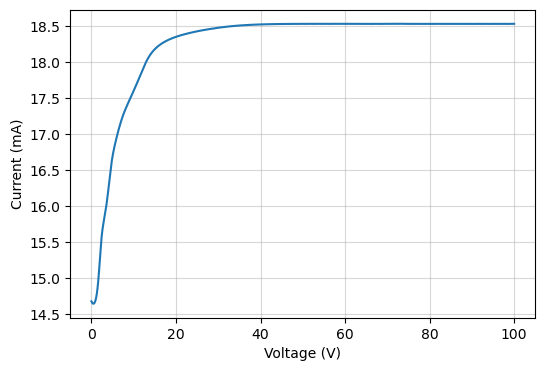

# DC Bias

This example analyzing the current flow passing through an output electrode
when applying a positive DC voltage bias to a NWN. The nanowire junctions
are evolved following the [Decay HP model](../reference/mnns/models.md#mnns.models.decay_HP_model)
as the memristive model of choice.

This can take around a minute or longer depending on the computer.

```python

```



[:material-download: Download Jupyter notebook: dc-bias.ipynb](../assets/python/dc-bias.ipynb){: download="dc-bias.ipynb" .md-button .md-button--primary }

[:material-download: Download Python file: dc-bias.py](../assets/python/dc-bias.py){: download="dc-bias.py" .md-button .md-button--primary }