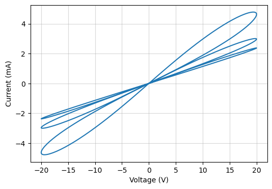

# Hysteresis

This example showcases a hysteresis plot using the [HP model](../reference/mnns/models.md#mnns.models.HP_model) as the memristive model the governs the nanowire junction evolution.

```python

```



[:material-download: Download Jupyter notebook: hysteresis.ipynb](../assets/python/hysteresis.ipynb){: download="hysteresis.ipynb" .md-button .md-button--primary }

[:material-download: Download Python file: hysteresis.py](../assets/python/hysteresis.py){: download="hysteresis.py" .md-button .md-button--primary }